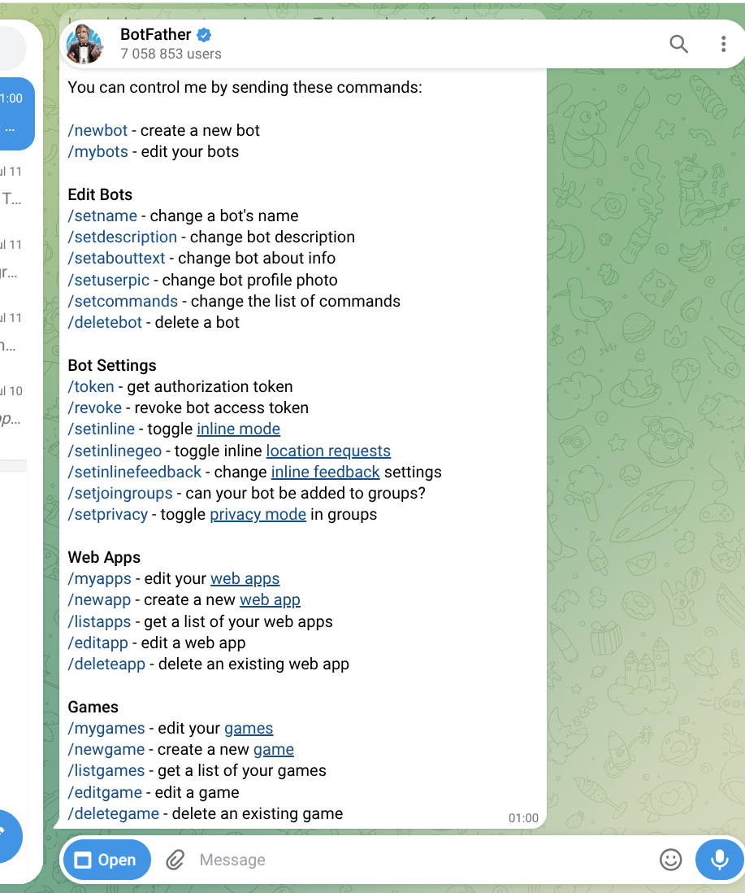
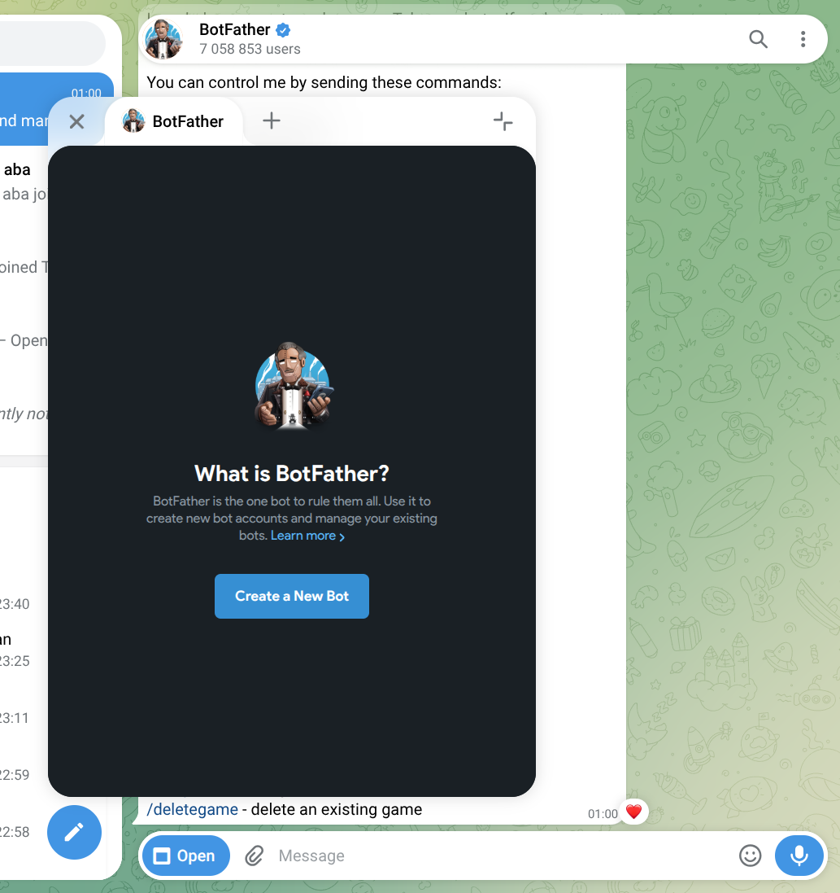
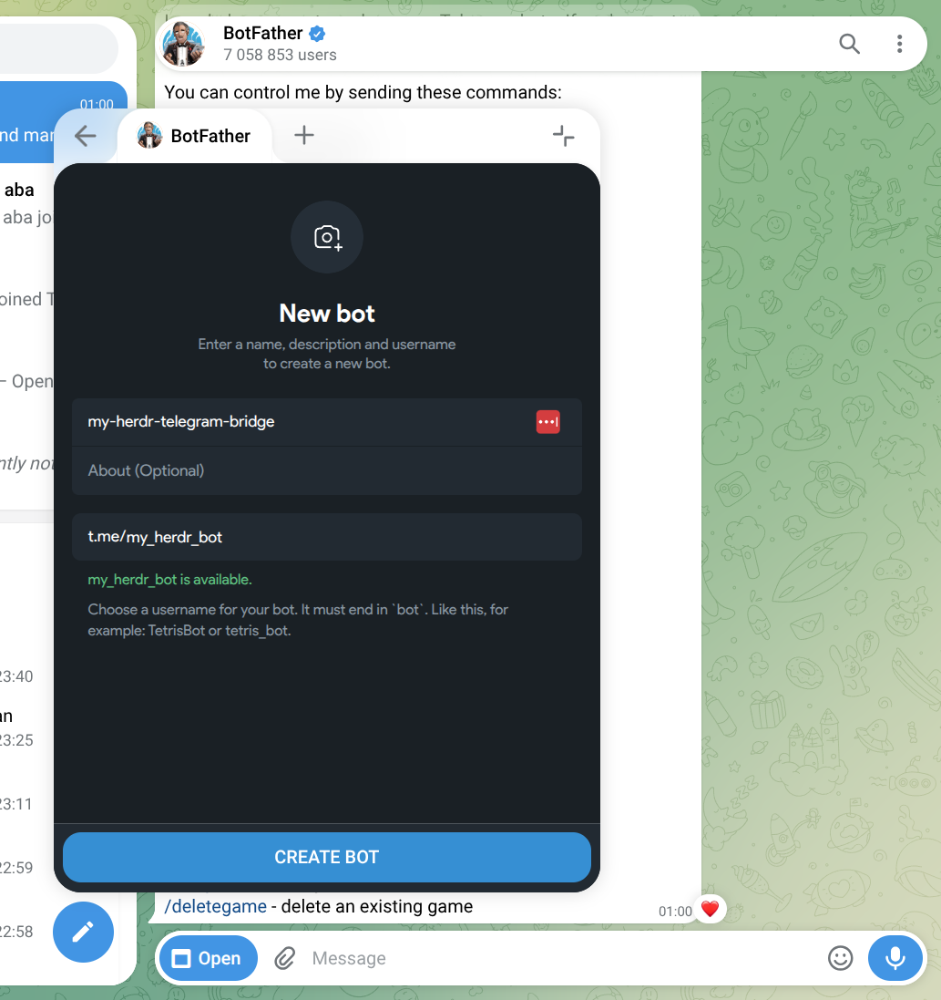
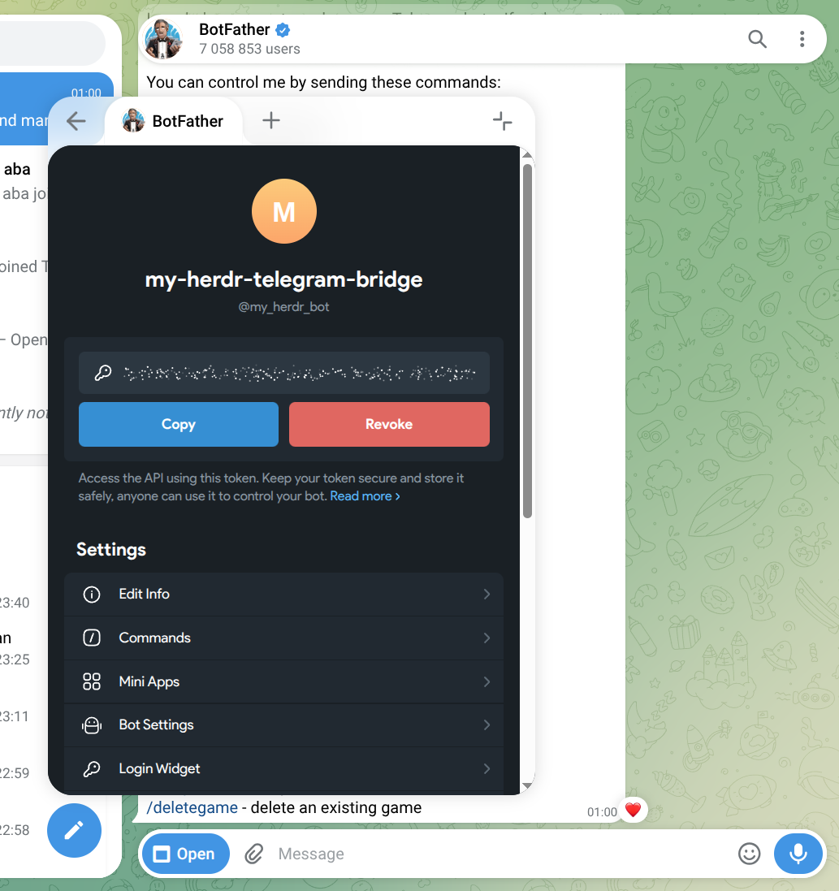
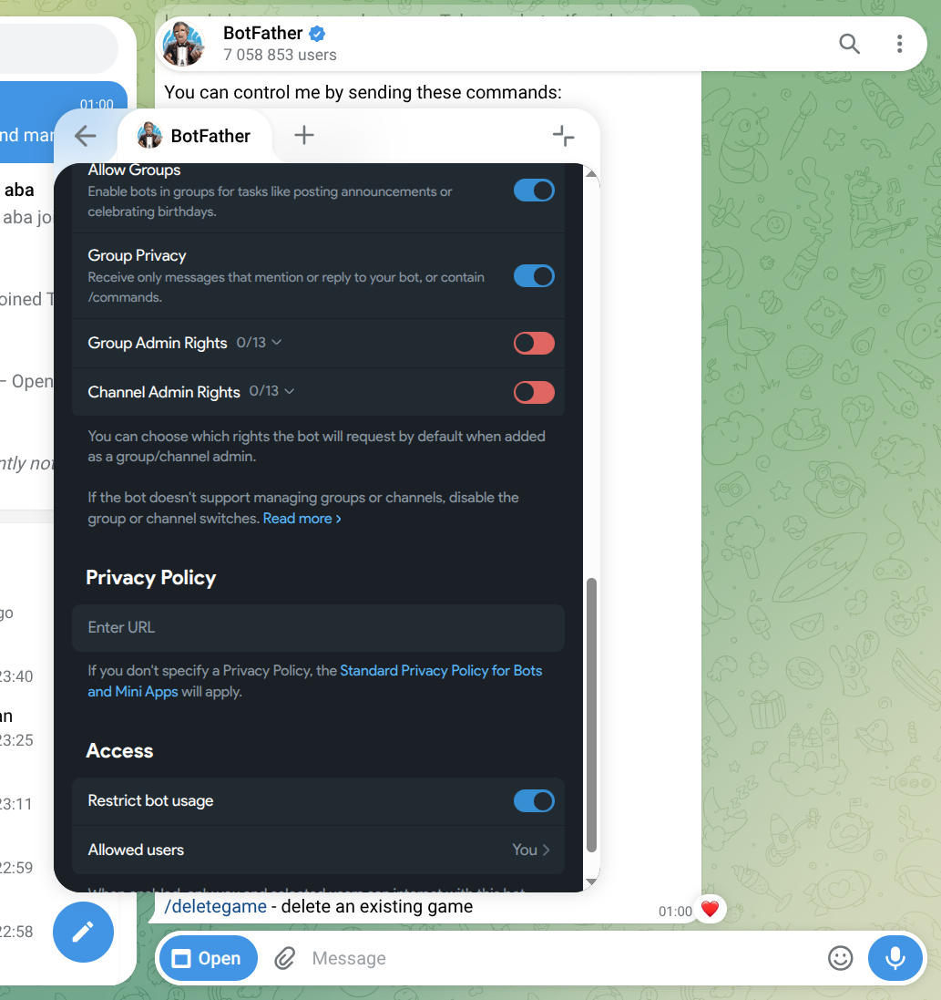
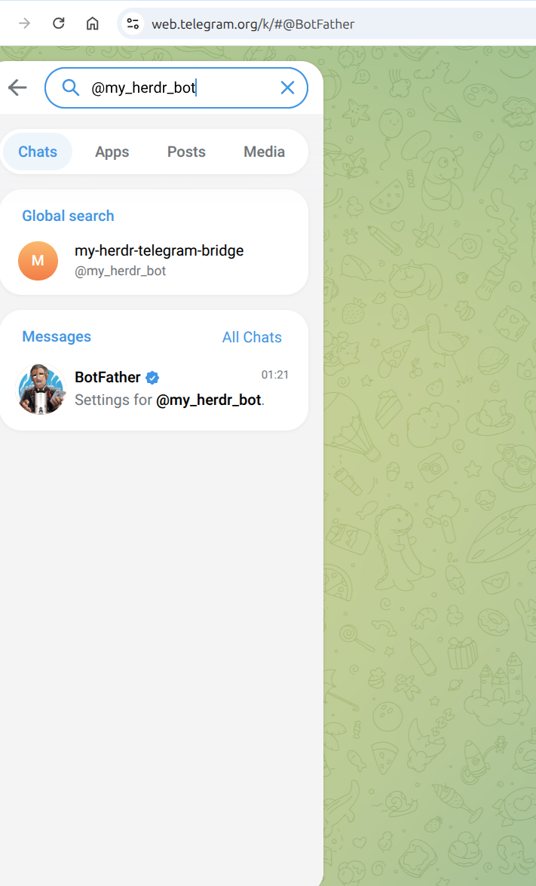

# Step 1: Create a Telegram Bot

## New to Telegram?

If you've never used Telegram before, start here:

1. **Download** the app from [telegram.org](https://telegram.org) — available for iOS, Android, Windows, macOS, Linux, and Web
2. **Sign up** with your phone number — Telegram sends a verification code via SMS
3. **Pick a username** — this is your public handle (e.g. `@yourname`)

No email, no password, no extra verification. Takes under 2 minutes.

## Create the bot with @BotFather

1. In Telegram, search for [@BotFather](https://t.me/BotFather) and start a chat



2. Send the command `/newbot`



3. Follow the prompts — give your bot a **name** and a **username** (must end in `bot`)



4. BotFather will reply with a **token**. Copy it — you'll need it in Step 3.



```
Done! Congratulations on your new bot. You will find it at t.me/your_bot.

Use this token to access the HTTP API:
1234567890:ABCdefGHIjklMNOpqrsTUVwxyz
```

:::tip Keep your token secret
Anyone with the token can control your bot. Never commit it to git.
:::

## Allow anyone to use the bot

By default, only you can interact with your bot. Disable this restriction:



This lets the bot receive messages from you in any chat.

## Find your bot

Search for your bot's username in Telegram and start a chat:



That's it — you now have a working bot. In Step 4 you'll pair it with herdr.

## Next

→ [Step 2: Install the Plugin](/tutorial/install)
