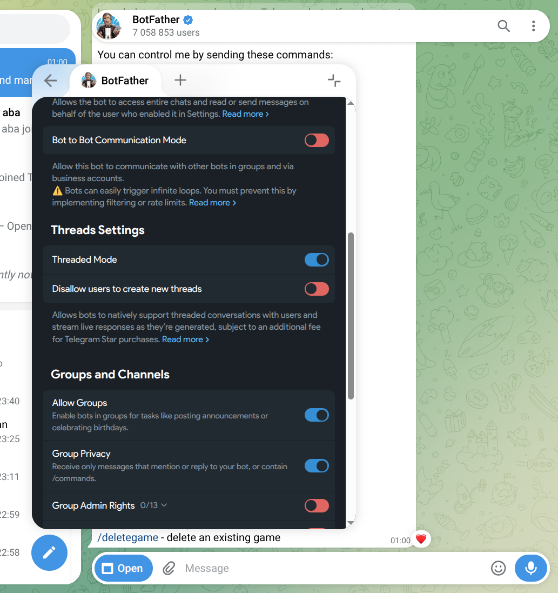

# Step 1: Create a Telegram Bot

## New to Telegram?

If you've never used Telegram before, start here:

1. **Download** the app from [telegram.org](https://telegram.org) — available for iOS, Android, Windows, macOS, Linux, and Web
2. **Sign up** with your phone number — Telegram sends a verification code via SMS
3. **Pick a username** — this is your public handle (e.g. `@yourname`)

No email, no password, no extra verification. Takes under 2 minutes.

## Create the bot with @BotFather

1. In Telegram, search for [@BotFather](https://t.me/BotFather) and start a chat


2. Send the command `/newbot`


3. Follow the prompts — give your bot a **name** and a **username** (must end in `bot`)


4. BotFather will reply with a **token**. Copy it — you'll need it in Step 3.


```
Done! Congratulations on your new bot. You will find it at t.me/your_bot.

Use this token to access the HTTP API:
1234567890:ABCdefGHIjklMNOpqrsTUVwxyz
```

:::tip Keep your token secret
Anyone with the token can control your bot. Never commit it to git.
:::

## Configure bot permissions

Still in @BotFather, set these two options:

```
/setjoingroups → Enable    (bot must be able to join groups)
/setprivacy  → Disable    (bot needs to see all messages, not just commands)
```

Also set the bot to allow anyone to interact with it:


These are required for the bot to receive messages inside forum topics.

## Create a Forum

The bot needs a **forum** (supergroup with topics enabled) to work:

1. In Telegram, tap the menu → **New Group**
2. Add at least one other person (you can remove them later)
3. Name the group, then go to **Group Settings → Topics → ON**



4. Find your bot and add it as a **member**, then promote it to **administrator**


5. Give the bot these admin permissions: **Manage Topics** and **Send Messages**

Your forum now has topics enabled and the bot is ready to create and manage them.

## Next

→ [Step 2: Install the Plugin](/tutorial/install)
