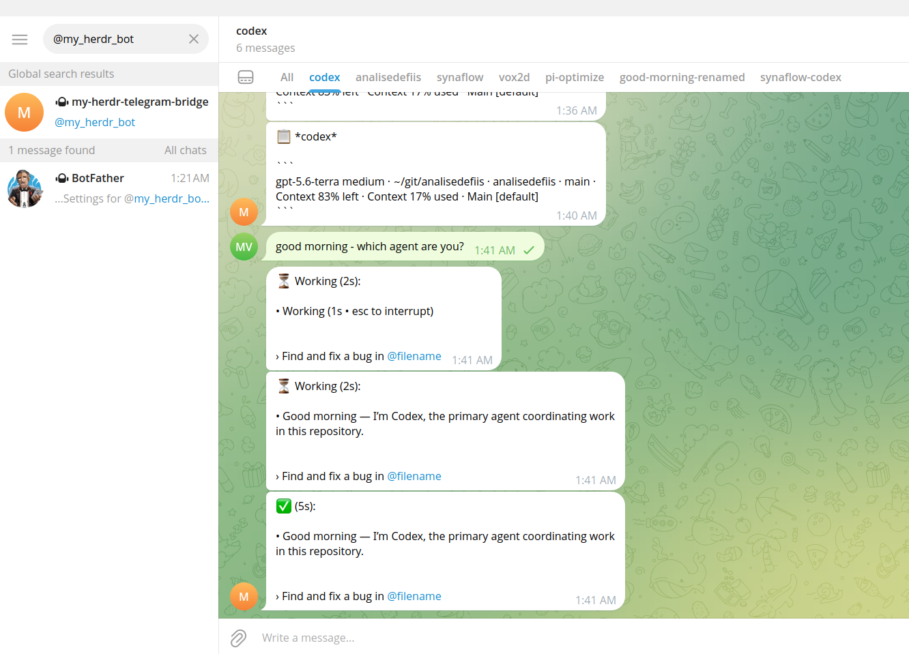

# Step 5: Daily Usage

## Talking to agents

Just type a message in any topic. The agent in the corresponding herdr tab receives it and responds.

You can ask questions, give instructions, or just check in:

```
"what's the status of the PR?"
"run the tests for me"
"summarize our conversation"
```

## Commands

All commands work in any topic or in the main forum chat.

| Command | Where | What it does |
|---|---|---|
| `/digest` | Inside a topic | Ask the agent for a summary of current work |
| `/bind <label>` | Inside a topic | Manually bind the topic to a specific herdr pane |
| `/cleanup` | Anywhere | Remove duplicate topics |
| `/reconcile` | Anywhere | Re-scan herdr tabs and sync topics |
| `/pair` | Main chat | Authorize the bot in a new chat |
| `/unpair` | Main chat | De-authorize and delete all topics |

## Tips

**Renaming tabs** — Rename a herdr tab and the Telegram topic name updates automatically.

**New tabs** — Open a new agent tab in herdr. Within 15 seconds a topic appears in Telegram.

**Closing tabs** — Close a herdr tab. The topic is deleted on the next watcher tick.

**Multiple agents** — Each tab can have a different agent model. Mix and match.



## Monitoring

```bash
# Check daemon status
node dist/index.js --status

# Watch logs
tail -f /tmp/daemon-*.log

# Restart the daemon
kill $(cat ~/.local/state/herdr-telegram/daemon.pid)
node dist/index.js --daemon
```

## Troubleshooting

See the full [Troubleshooting guide](/guide/troubleshooting) for common issues.
