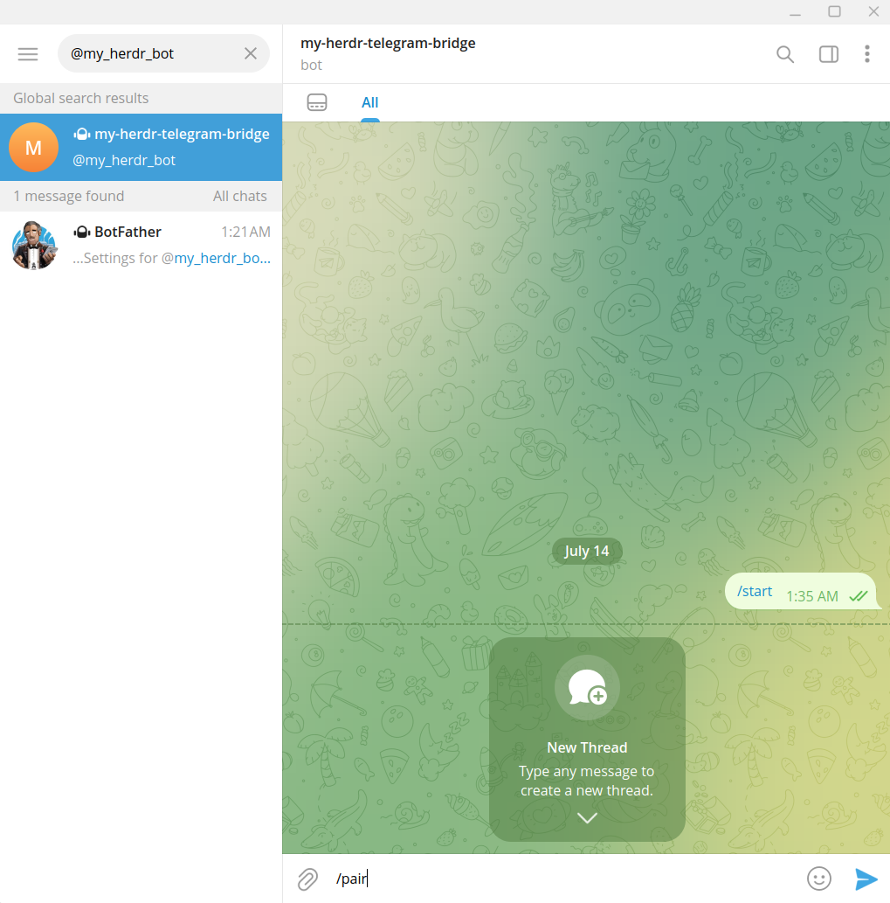
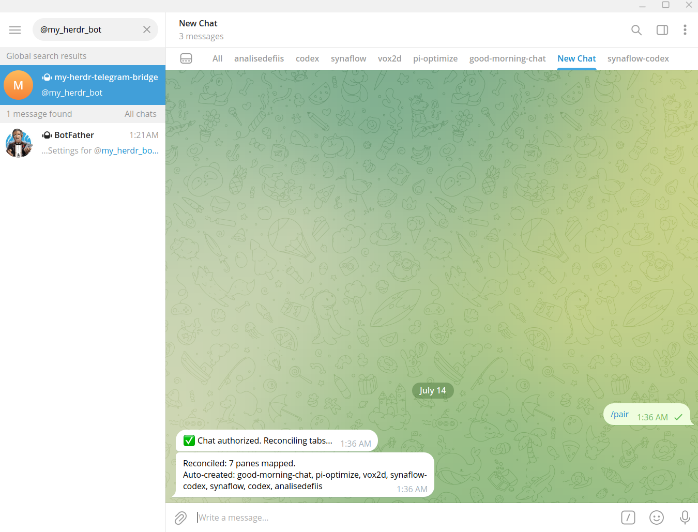
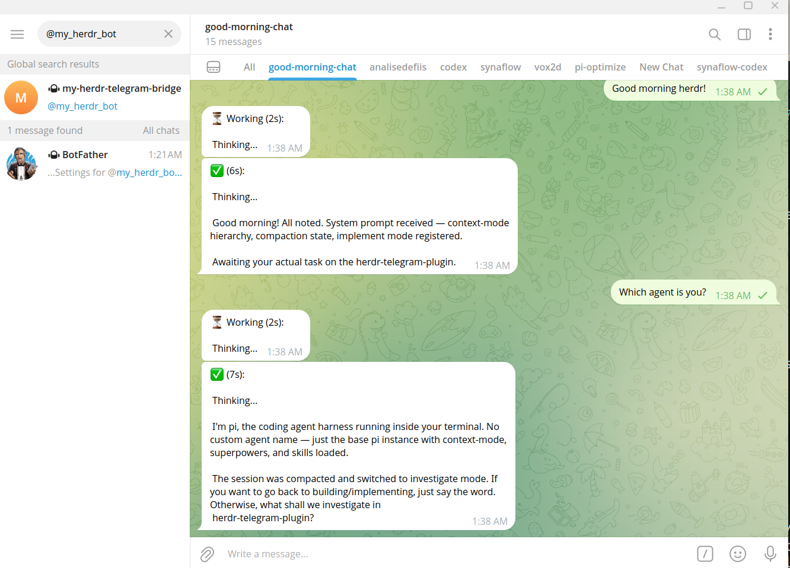

# Step 4: Pair & First Message

## Authorize the bot

1. Open your chat with the bot (the one from Step 1)
2. Send `/pair`



The bot replies:

```
✅ Chat authorized. Reconciling tabs...
```

Your herdr agent tabs are now linked to the bot. The watcher syncs them in the background.



:::tip Tab sync
The watcher polls every 15 seconds. New agent tabs may take a few seconds to appear in the mapping.
:::

## Send your first message

Just type a message:



You'll see:

```
⏳ Working (2s):

[agent thinking...]

✅ (5s):

Here's what I'm working on...
```

That's it! Your agent heard you and responded.

## What's happening under the hood

1. Your message → forwarded to the herdr pane as keyboard input
2. Plugin polls the pane until the agent finishes typing
3. Response extracted and sent back to Telegram
4. **Zero LLM cost in the plugin** — it just reads/writes terminal buffers

## Next

→ [Step 5: Daily Usage](/tutorial/daily-usage)
